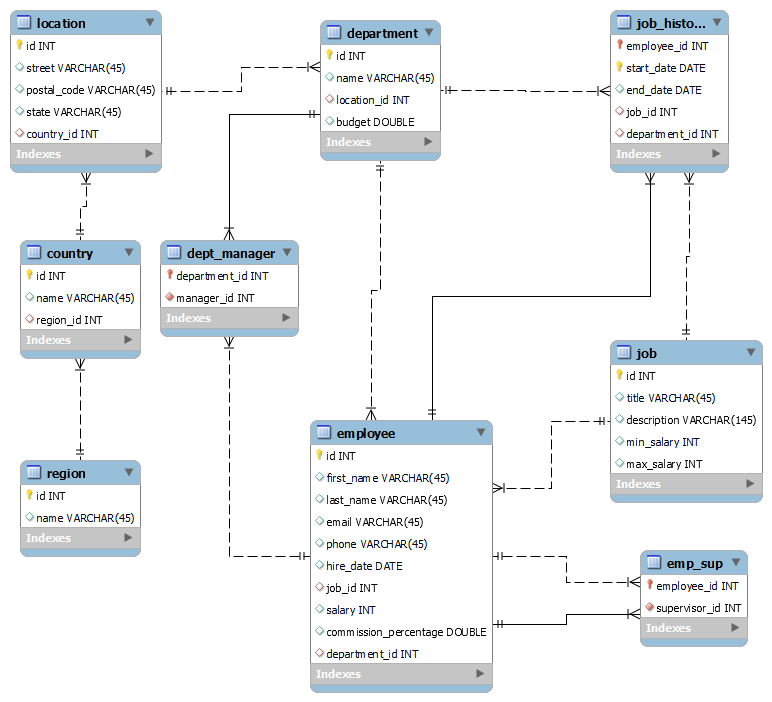

# HR Schema and Database (MySQL)

This project implements a comprehensive HR database schema using MySQL. It includes table definitions, data insertion scripts, and advanced analytical SQL queries. The project demonstrates proficiency in relational database design, DDL/DML scripting, and query writing for real-world HR data management scenarios.

## Technologies Used

- **Database:** MySQL
- **Language:** SQL (DDL & DML)
- **Concepts:** Primary & Foreign Keys, Constraints, Joins, Aggregations, CTEs

---

## Tables Created

Write a DDL file to create the HR database and all associated tables based on the schema diagram below:

---

## Data Inserted

The database is populated with realistic test data:

- 2 regions  
- 3 countries  
- 5 different locations  
- 6 departments with varying budgets  
- 26 employees with diverse roles and salaries  
- 24 job titles (ranging from Assistant to C-level)  
- Detailed job history with:
  - At least 2 employees having 3+ job history records
  - Full historical and current job tracking  
- Defined supervisor relationships (`emp_sup`)
- Defined department managers (`dept_manager`)

---

## SQL Queries

1. List the highest and lowest salaries offered for each job title.
2. Find all employees who earn a salary higher than the average salary of their department.
3. Calculate the total budget for each region, summing the budgets of all departments in that region.
4. Find the department with the highest number of employees.
5. List all employees who are managers of departments, including their name, department name, and location.
